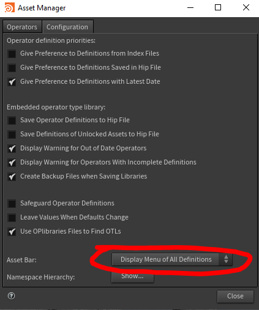
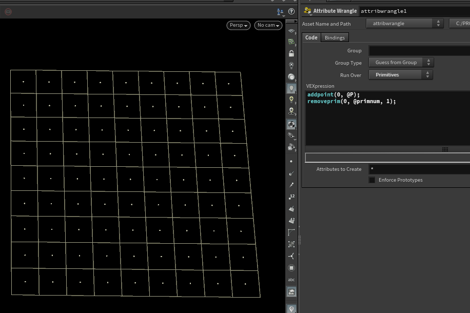

[< Wiki Index](/README.md)

# Houdini

 - [Misc](#misc)
 - [Rigging](#rigging)
 - [HDAs](#hdas)
 - [Vex](#vex)
 - [Python](#python)
 - [Retopo](#retopo)
 - [Cloth](#cloth)
 
 
:star: I also have saved some useful snippets as [gists](https://gist.github.com/simonreeves)

## Third party Tools
A rough list of some free, some paid, useful HDAs and tool sets

 - Lucas Scheller LYNX fabric/weave HDAs https://www.lucascheller.de/posts/ecae2c0393b0980c5c909b5060fdc1a3/
 - OD tools https://origamidigital.com/cart/index.php?route=product/product&path=59_63&product_id=64

## Other blogs/tutorials
 - [vex wrangle cheat sheet](https://mrkunz.com/blog/08_22_2018_VEX_Wrangle_Cheat_Sheet.html)
 - [gfxhacks.com create parms in python](https://gfxhacks.com/create-parameters-in-houdini-with-python)
 
## Misc
#### Rotate camera 360 in 100 frames
as an expression
```
fit(@Frame, 1001, 1101, 0, 360)
```

### Frame Sequence translate from frame 1 to 1001
In camera background for example
```
$JOB/MySequence.`padzero(4, $F4-1000)`.jpg
```

## Rigging
Just watch these Sidefx tutorials by Michael Goldfarb
 - Scripts are included on the [sidefx page](https://www.sidefx.com/tutorials/rigging-series-01-hda-spine/)
 - watch the [series 1 playlist](https://www.youtube.com/playlist?list=PLXNFA1EysfYkxrb8DlW05gBi1LOZKBbHS)
 - [series 2 is one big video that coves deformation](https://www.youtube.com/watch?v=vinCWv20Ib4) 

:heavy_check_mark: Watch on youtube instead of vimeo, better player, supports resuming.


## HDAs
[The SideFX rigging tutorials](https://www.youtube.com/playlist?list=PLXNFA1EysfYkxrb8DlW05gBi1LOZKBbHS) have lots of useful tips on how to create, and manage HDAs

#### Turn on asset definitions toolbar


Turning on the asset definitions toolbar is useful for to see the version of a HDA in your scene (toolbar appears at top of parameters window) Assets Toolbar > Asset Manager... > Configuration tab > Asset Bar  switch dropdown menu to 'Display Menu of All Definitions'
[Enable asset bar to show versions](https://youtu.be/jxpb36URQ9M?t=471)

#### Param Callbacks
This is detailed in the help, but briefly:
  - On a param's 'Callback Script' setting, add callback code like
```python
hou.pwd().hm().my_function(kwargs)
```
  - Then in the *scripts* tab, add a `PythonModule`
  - Then add the function with kwargs argument
    - If the param was a menu for example, `script_value0` returns the item selected in the dropdown
```python
def my_function(kwargs):
    this_node = kwargs['node']
    selection_value = kwargs['script_value0']
```


#### Set HDA node look and settings
To set a HDA's initial look, add a `OnCreated` python script in scripts tab. The following code sets the shape as 'clipped_left' and to some blueish colour.

```python
kwargs['node'].setUserData('nodeshape', 'clipped_left')
kwargs['node'].setColor(hou.Color(0.175, 0.3, 0.35))
```
If it is a material, it is useful to set the material flag
```python
kwargs['node'].setMaterialFlag(True)
```

## Camera
Set focus from object (null), this expression gets distance between origins of two objects
```
vlength(vtorigin(".","../focus"))
```

## Retopo
 - Clear [simple quick video](https://www.youtube.com/watch?v=yAF3HtIFiVc) about using the retopo tool !
 
 
## Cloth
 - As of H18 - always set substeps to [at least 5](https://youtu.be/1ztATWCOwn8?t=94), fixes initial stretching - then consider reducing collision passes.
 - Really useful section of [Sidefx Jeff Laits vellum cloth tutorial](
https://youtu.be/4nC-L19400I?t=12200), he shows a (complicated!) way to extract the holes after using create planar patch
 - [Help initially intersecting collisions](https://youtu.be/4nC-L19400I?t=2344)
 - [Un-pin using @stopped attribute (vellum H17)](https://youtu.be/NwabG-znu9Y?t=3113)
 - [stiffness dropoff](https://youtu.be/zPQZ8KJTjzo?t=1037)
## Python

Check if in UI mode, ie. disable popups or enable things only when rendering

```pythob
hou.isUIAvailable()
```

Create `null` objects from `transform SOPs`.
This can be useful to re-create transforms at object level instead of 'deforming' geometry which is much heavier.

```python
def nulls_from_x():
    for node in hou.selectedNodes():
        print(node.name())
        t = node.parmTuple('t').eval()
        r = node.parmTuple('r').eval()
        s = node.parmTuple('s').eval()
        scale = node.parm('scale').eval()

        new_null = hou.node('obj/').createNode('null')
        new_null.parmTuple('t').set(t)
        new_null.parmTuple('r').set(r)
        new_null.parmTuple('s').set(s)
        new_null.parm('scale').set(scale)
```

## VEX
#### General useful vex wrangle examples
```c
// get nearest point index of second input
int np = nearpoint(1, @P);

// get that point's position
vector np_pos = point(1, 'P', np);

// measure distance
float dist = distance(@P, np_pos);

// normalise distance
dist = fit(dist, ch('in_min'), ch('in_max'), ch('out_min'), ch('out_max'));

// remap with ramp
dist = chramp('remap', dist);

// set attribute
f@dist = dist;
```
#### get centroid
```c
// get centroid
vector min, max;
getbbox(min, max);
vector centroid = (min+max)/2;
```


#### Create random direction vector in cone
```c
vector axis = {0, 1, 0};
vector2 u = rand(@class);
vector direction = sample_direction_cone(axis, radians(ch("angle")), u);
```
#### Add point on each prim


```c
addpoint(0, @P);
removeprim(0, @primnum, 1);
```

## Redshift
Not well documented, how to enable console log
```python
# Toggle Redshift console log
hou.hscript("Redshift_setLogLevel -L 5")

# Set log level
hou.hscript("Redshift_switchConsoleLog")
```
