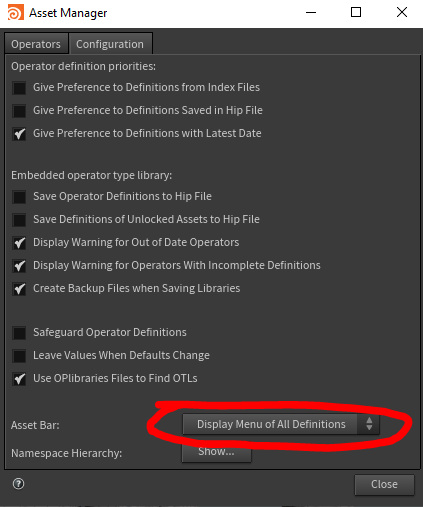

[< Wiki Index](/README.md)

# Houdini

 - [Rigging](#rigging)
 - [HDAs](#hdas)
 - [Vex](#vex)
 - [Python](#python)
 - [Retopo](#retopo)
 - [Cloth](#cloth)
 


## Rigging
Just watch these Sidefx tutorials by Michael Goldfarb
 - Scripts are included on the [sidefx page](https://www.sidefx.com/tutorials/rigging-series-01-hda-spine/)
 - watch the [series 1 playlist](https://www.youtube.com/playlist?list=PLXNFA1EysfYkxrb8DlW05gBi1LOZKBbHS)
 - [series 2 is one big video that coves deformation](https://www.youtube.com/watch?v=vinCWv20Ib4) 

:heavy_check_mark: Watch on youtube instead of vimeo, better player, supports resuming.


## HDAs
[The SideFX rigging tutorials](https://www.youtube.com/playlist?list=PLXNFA1EysfYkxrb8DlW05gBi1LOZKBbHS) have lots of useful tips on how to create, and manage HDAs

#### Turn on asset definitions toolbar


Turning on the asset definitions toolbar is useful for to see the version of a HDA in your scene (toolbar appears at top of parameters window) Assets Toolbar > Asset Manager... > Configuration tab > Asset Bar  switch dropdown menu to 'Display Menu of All Definitions'
[Enable asset bar to show versions](https://youtu.be/jxpb36URQ9M?t=471)


#### Set HDA node shape & color
To set a HDA's initial look add a `OnCreated` python script in scripts tab. The following code sets the shape as 'clipped_left' and to some blueish colour.

```python
kwargs['node'].setUserData('nodeshape', 'clipped_left')
kwargs['node'].setColor(hou.Color(0.175, 0.3, 0.35))
```

## Camera
Set focus from object (null), this expression gets distance between origins of two objects
```
vlength(vtorigin(".","../focus"))
```

## Retopo
 - Clear [simple quick video](https://www.youtube.com/watch?v=yAF3HtIFiVc) about using the retopo tool !
 
 
## Cloth
 - As of H18 - always set substeps to [at least 5](https://youtu.be/1ztATWCOwn8?t=94), fixes initial stretching - then consider reducing collision passes.
 - Really useful section of [Sidefx Jeff Laits vellum cloth tutorial](
https://youtu.be/4nC-L19400I?t=12200), he shows a (complicated!) way to extract the holes after using create planar patch
 - [Help initially intersecting collisions](https://youtu.be/4nC-L19400I?t=2344)
 - [Un-pin using @stopped attribute (vellum H17)](https://youtu.be/NwabG-znu9Y?t=3113)

## Python

Check if in UI mode, ie. disable popups or enable things only when rendering

```pythob
hou.isUIAvailable()
```

Create `null` objects from `transform SOPs`.
This can be useful to re-create transforms at object level instead of 'deforming' geometry which is much heavier.

```python
def nulls_from_x():
    for node in hou.selectedNodes():
        print(node.name())
        t = node.parmTuple('t').eval()
        r = node.parmTuple('r').eval()
        s = node.parmTuple('s').eval()
        scale = node.parm('scale').eval()

        new_null = hou.node('obj/').createNode('null')
        new_null.parmTuple('t').set(t)
        new_null.parmTuple('r').set(r)
        new_null.parmTuple('s').set(s)
        new_null.parm('scale').set(scale)
```

## VEX
vex wrangle examples
```c
// get nearest point index of second input
int np = nearpoint(1, @P);

// get that point's position
vector np_pos = point(1, 'P', np);

// measure distance
float dist = distance(@P, np_pos);

// normalise distance
dist = fit(dist, ch('in_min'), ch('in_max'), ch('out_min'), ch('out_max'));

// remap with ramp
dist = chramp('remap', dist);

// set attribute
f@dist = dist;
```

## Redshift
Not well documented, how to enable console log
```python
# Toggle Redshift console log
hou.hscript("Redshift_setLogLevel -L 5")

# Set log level
hou.hscript("Redshift_switchConsoleLog")
```
